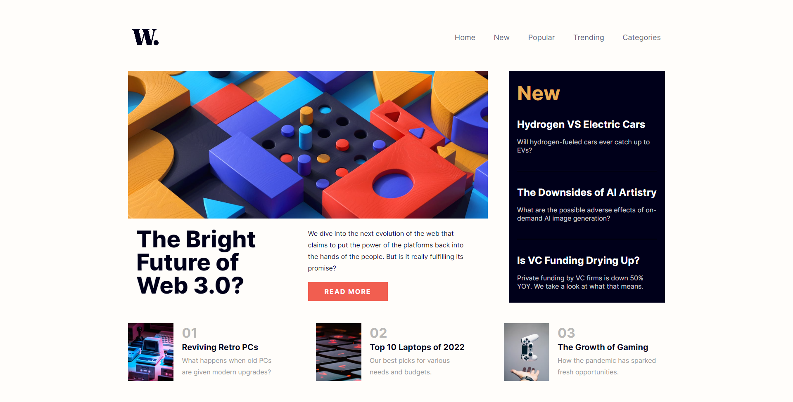

# Frontend Mentor - News homepage solution

This is a solution to the [News homepage challenge on Frontend Mentor](https://www.frontendmentor.io/challenges/news-homepage-H6SWTa1MFl). 

Frontend Mentor challenges help you improve your coding skills by building realistic projects. 

## Table of contents

- [Overview](#overview)
  - [The challenge](#the-challenge)
  - [Screenshot](#screenshot)
  - [Links](#links)
- [My process](#my-process)
  - [Built with](#built-with)
  - [What I learned](#what-i-learned)
  - [Continued development](#continued-development)
  - [Useful resources](#useful-resources)
- [Author](#author)
- [Acknowledgments](#acknowledgments)

## Overview

### The Challenge
---
Users should be able to:

- View the optimal layout for the interface depending on their device's screen size
- See hover and focus states for all interactive elements on the page
- **Bonus**: Toggle the mobile menu (requires some JavaScript) ***(I utilized CSS for this)***

### Screenshot
---


### Links
---
- Solution URL: [Github](https://github.com/Fqthom/News)
- Live Site URL: [Github Pages](https://fqthom.github.io/News)

## My process

I started this project with a Desktop first approach, using Flexbox as needed. The most difficult approach was the animation of the hamburger menu on smaller screens. With no experience with 

### Built with
---
- Semantic HTML5 markup
- CSS custom properties
- Flexbox
- Checkbox Toggle Mobile Nav Menu

### What I learned
---
This was my first experience building a working mobile nav menu using my own research. It was a great learning experience to find a theory and building it into my existing code, as I had started off with a Desktop approach first.

*(Going forward, I may think of starting on Mobile)*

```html
<input type="checkbox" class="icon-toggle" id="icon-toggle">
          <label for="icon-toggle" class="hamburger">
            <span class="icon-bar diag1"></span>
            <span class="icon-bar horizontal"></span>
            <span class="icon-bar diag2"></span>
          </label>
        <div id="overlay"></div>
```
```css
input[type="checkbox"]:checked ~ #hm-nav{
    transform: translateX(0);
}
input[type="checkbox"]:checked ~ #overlay{
    visibility: visible;
    opacity: 1;
    transition: opacity 300ms;
}
input[type=checkbox]{
    transition: all 1s;
    box-sizing: border-box;
    display: none;
}
input[type="checkbox"]:checked ~ .hamburger > .horizontal{
    transition: all 300ms;   
    opacity: 0;
}
input[type="checkbox"]:checked ~ .hamburger > .diag1{
    transition: all 300ms;
    transform: translate3d(0,8px,0) rotate(45deg);
}
input[type="checkbox"]:checked ~ .hamburger > .diag2{
    transition: all 300ms;
    transform: translate3d(0,-8px,0) rotate(-45deg);
}
```

### Continued development
---
I will eventually get around to doing this project again, using the jQuery toggle function. I believe the solution here is clever, but isn't the best implementation.

### Useful resources
---
- [Free Frontend Slide Menu](https://codepen.io/dannievinther/pen/NvZjvz)

This example from Frontend really helped me flesh out a great hamburger icon. The original project came with 2 svg's, but with little to no experience in Jquery or JS, I decided to use CSS.

---

- [Free Frontend Sidebar Toggle](https://codepen.io/plavookac/pen/qomrMw)

This example helped me utilize a checkbox as a way of checking statuses of an object, and creating effects based on that status. This was a great hands-on experience for utilizing creative thinking to achieve a desired result.

## Author

- Website - [Github](https://github.com/Fqthom)
- Frontend Mentor - [@Fqthom](https://www.frontendmentor.io/profile/Fqthom)

## Acknowledgments

Shoutouts to these two developers here, for providing their awesome code on Free Frontend, that really helped me finish this project.

- [Dannie Vinther](https://codepen.io/dannievinther)

- [Jelena Jovanovic](https://codepen.io/plavookac)
